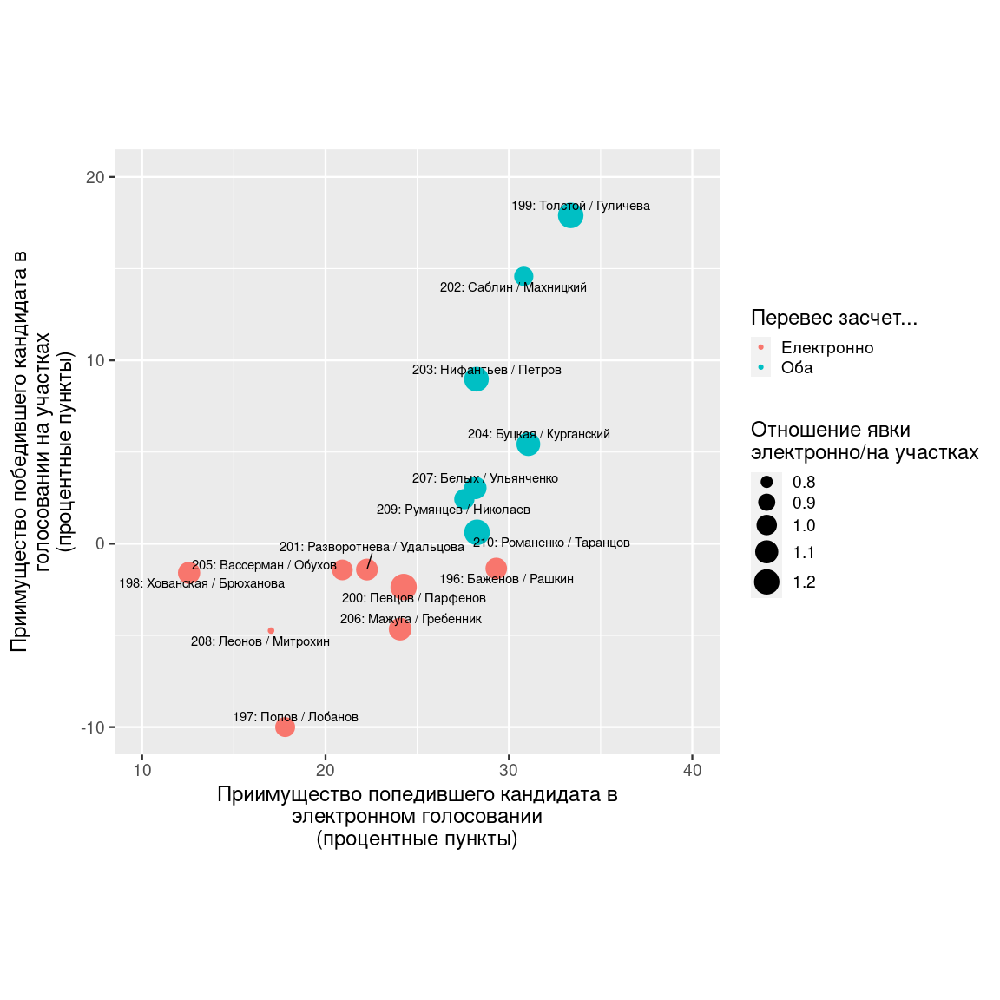
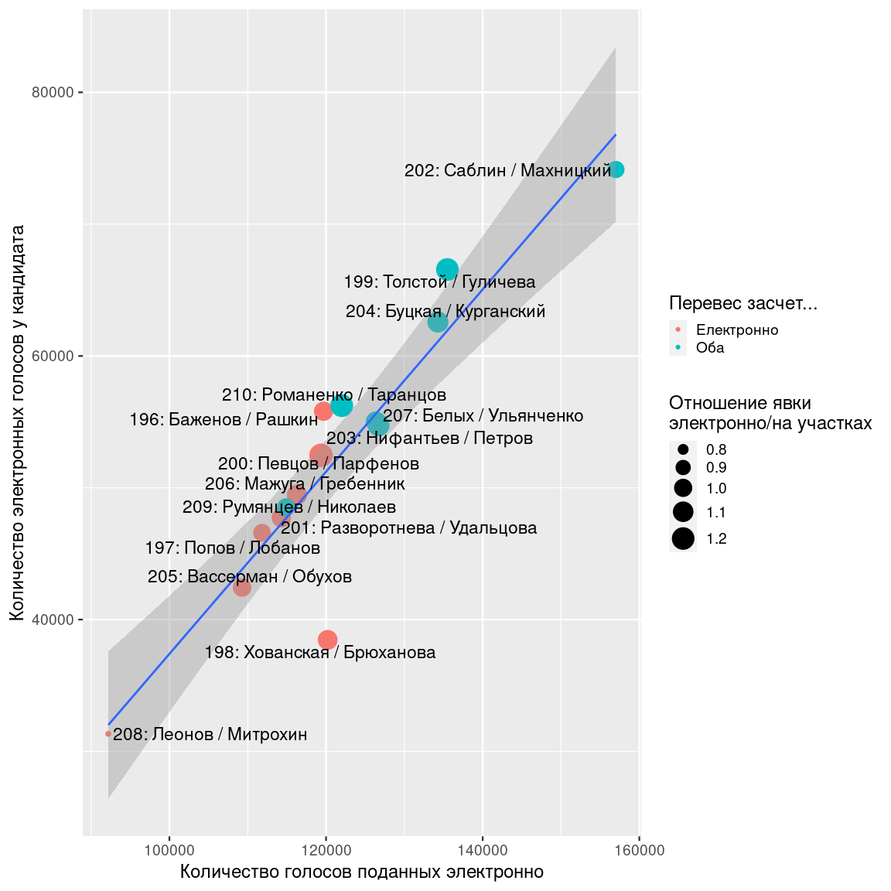

Загружаем нужные библиотеки

``` r
suppressMessages(library(readr))
suppressMessages(library(ggplot2))
suppressMessages(library(reshape2))
suppressMessages(library(dplyr))
suppressMessages(library(tidyr))
suppressMessages(library(gridExtra))
options(dplyr.summarise.inform = FALSE)
```

Открываем данные опубликованные на
[Медузе](https://meduza.io/slides/moskovskoe-elektronnoe-golosovanie-eto-chto-to-s-chem-to-posmotrite-kak-ono-pomenyalo-rezultaty-vyborov-v-okrugah-gde-pobezhdala-oppozitsiya).
Выбираем двух кандидатов с наибольшим количеством голосов

``` r
setwd("/mnt/e/Workspace/RussiaElections2021")
elections_df = readr::read_tsv("data/elections_meduza_final.tsv")
```

    ## 
    ## ── Column specification ──────────────────────────────────────────────────────────────────────────────────────────────────────────
    ## cols(
    ##   elections_candidate = col_character(),
    ##   elections_inperson_count = col_double(),
    ##   elections_electronic_count = col_double(),
    ##   elections_total_count = col_double(),
    ##   elections_inperson_percent = col_double(),
    ##   elections_electronic_percent = col_double(),
    ##   elections_total_percent = col_double(),
    ##   elections_aik = col_double()
    ## )

``` r
elections_fdf = elections_df %>%
  dplyr::mutate(elections_candidate_short=gsub("([^ ]+).*", "\\1", elections_candidate)) %>%
  dplyr::group_by(elections_aik) %>%
  dplyr::arrange(dplyr::desc(elections_total_percent)) %>%
  dplyr::mutate(elections_aik_total_count=sum(elections_electronic_count) + sum(elections_inperson_count)) %>%
  dplyr::mutate(elections_aik_electronic_count=sum(elections_electronic_count)) %>%
  dplyr::mutate(elections_aik_inperson_count=sum(elections_inperson_count)) %>%
  dplyr::slice(1:2) %>%
  dplyr::mutate(elections_aik_subtotal_count=sum(elections_electronic_count) + sum(elections_inperson_count)) %>%
  dplyr::group_by(elections_aik, elections_aik_total_count, elections_aik_subtotal_count, elections_aik_electronic_count, elections_aik_inperson_count) %>%
  dplyr::summarize(
    elections_aik_desc=paste0(elections_aik[1], ": ", elections_candidate_short[1], " / ", elections_candidate_short[2]),
    elections_electronic_prcdiff=elections_electronic_percent[1]-elections_electronic_percent[2],
    elections_inperson_prcdiff=elections_inperson_percent[1]-elections_inperson_percent[2],
    elections_total_count1=elections_total_count[1],
    elections_total_count2=elections_total_count[2],
    elections_electronic_percent1=elections_electronic_percent[1],
    elections_electronic_percent2=elections_electronic_percent[2],
    elections_electronic_count1=elections_electronic_count[1],
    elections_electronic_count2=elections_electronic_count[2],
    elections_inperson_percent1=elections_inperson_percent[1],
    elections_inperson_percent2=elections_inperson_percent[2],
    elections_inperson_count1=elections_inperson_count[1],
    elections_inperson_count2=elections_inperson_count[2],
    elections_electronic_diff=elections_electronic_count[1]-elections_electronic_count[2],
    elections_inperson_diff=elections_inperson_count[1]-elections_inperson_count[2],
    elections_total_diff=elections_total_count[1]-elections_total_count[2],
  ) %>%
  dplyr::mutate(elections_decided_by=dplyr::case_when(
    elections_inperson_diff>=0 & elections_electronic_diff>=0 ~ "Оба",
    elections_inperson_diff>=0 & elections_electronic_diff<=0 ~ "На участках",
    elections_electronic_diff>=0 & elections_inperson_diff<=0 ~ "Електронно",
    T<=0 ~ "What?",
  ))
```

Сначала для общей картины взглянем на количество голосов электронного
голосования и голосования на участках. Количество проголосовавших
избирателей сопоставимо и в принципе не сильно отличается. Но здесь
нужно помнить, что перевес в голосах между первым и вторым кандидатами
зачастую составляет всего 10%, что не очень много если мы ищем аномалии

``` r
ggplot(elections_fdf %>% reshape2::melt(id.vars=c("elections_aik", "elections_aik_desc"), measure.vars=c("elections_aik_electronic_count", "elections_aik_inperson_count")) %>% dplyr::mutate(variable=ifelse(grepl("inperson", variable), "На участке", "Электронно"))) +
  geom_bar(aes(x=elections_aik_desc, y=value, fill=variable), stat="identity", alpha=0.5, position=position_nudge()) +
  labs(x="Изберательный округ", y="Количество проголосовавших", fill="Способ голосования") +
  theme_classic(base_size=20)+
  theme(axis.text.x = element_text(angle = 45, hjust=1), legend.position="top")
```


``` r
ggplot(elections_fdf) +
  geom_bar(aes(x=elections_aik_desc, y=100*elections_total_diff/elections_aik_total_count), stat="identity", alpha=0.5, position=position_nudge()) +
  labs(x="Изберательный округ", y="Сумарный перевес победителя\n(в процентах)", fill="Способ голосования") +
  theme_classic(base_size=20)+
  theme(axis.text.x = element_text(angle = 45, hjust=1), legend.position="top")
```


Кажется на Дожде кто-то из собеседников сказал что есть зависимость
между набранными голосами в электронном голосовании и отставанием
провластных кандидатов в голосовании на участках. Проверим… Красным
помечены участки, где кандидат лидировавший на участках проиграл за счет
голосования. Изходя из заявления у победившего в сумме кандидата будет
маленький процент на участке и большой электронно. На графике мы видим
что кандидаты победившие электронно и на участках (синий) имеют в целом
даже больший отрыв на участках чем проигравшие кандидаты, но…
распределение их визуально отличается от распределения на тех участках
где лидировавший на участках кандидат проиграл.В данном случае данные
содержат целые округа и их количества недостаточно для каких либо
выводов

``` r
ggplot(elections_fdf, aes(x=elections_electronic_prcdiff, y=elections_inperson_prcdiff)) +
  geom_point(aes(color=elections_decided_by, size=elections_aik_electronic_count/elections_aik_inperson_count)) +
  ggrepel::geom_text_repel(aes(label=elections_aik_desc)) +
  scale_size_continuous(range=c(2, 10)) +
  labs(x="Приимущество попедившего кандидата в\nэлектронном голосовании\n(процентные пункты)", y="Приимущество победившего кандидата в\nголосовании на участках\n(процентные пункты)", color="Перевес засчет...", size="Отношение явки\nэлектронно/на участках") +
  coord_fixed(xlim=c(10, 40), ylim=c(-10, 20)) +
  theme_gray(base_size=18)
```

 По
ходу дела у меня родилась еще одна идея, проверить отношение количества
электронных голосов у кандидата к общему количеству электронных голосов.
Естественно здесь была корреляция, и очень сильная, что в данном случае
полезно для подсчетов. Сильную корреляцию для себя я объясняю тем, что
есть у про-властных кандидатов в целом есть большой процент избирателей
пришедших голосовать за них (медиана % голосов на эл. голосовании -
43.2%) количество голосов соответственно авто-коррелирует с общим
количеством электронных голосов на участке. Что странно, так это что
если примирить линейную модель (которая в данном случае весьма
качественная, R=0.92) и попытаться предсказать количество голосов
отданных за победившего кандидата, то получится что у него на счету уже
будут 18,331 голосов. И это при вероятности в одну сотую (0.01%)
процента, что модель завышает результат. Перемножив это на 15 округов
получим цифру в минимум 274,976 сомнительных голосов

``` r
ggplot(elections_fdf, aes(x=elections_aik_electronic_count, y=elections_electronic_count1)) +
  geom_point(aes(color=elections_decided_by, size=elections_aik_electronic_count/elections_aik_inperson_count)) +
  geom_smooth(method="lm") +
  ggrepel::geom_text_repel(aes(label=elections_aik_desc), size=6) +
  scale_size_continuous(range=c(2, 10)) +
  labs(x="Количество голосов поданных электронно", y="Количество электронных голосов у кандидата", size="Отношение явки\nэлектронно/на участках", color="Перевес засчет...") +
  theme_gray(base_size=18)
```

    ## `geom_smooth()` using formula 'y ~ x'



``` r
elections_model = lm(elections_aik_electronic_count ~ elections_electronic_count1, data=elections_fdf)
intercept_mean = elections_model$coefficients["(Intercept)"]
intercept_ci = confint(elections_model, "(Intercept)", level=0.9998)
R_ci = confint(elections_model, "R", level=0.9998)
R_test = cor.test(elections_fdf$elections_aik_electronic_count, elections_fdf$elections_electronic_count1, method="pearson", conf.level=0.9998)

report_df = data.frame(name="Коэфициент корреляции (R):", value=round(R_test$estimate, 2), confidence_interval=paste0("[", round(R_test$conf.int[1], 2), ", ", round(R_test$conf.int[2], 2), "]"))
report_df = rbind(report_df, data.frame(name="Количество голосов у лидирующих кондедатов\nнеобъясняемое явкой (где x=0): ",  value=as.character(round(intercept_mean)),  confidence_interval=paste0("[", round(intercept_ci[1]), ",", round(intercept_ci[2]), "]")))
report_df = rbind(report_df, data.frame(name="Сумарное колличество сомнительных голосов: ",  value=as.character(round(intercept_mean*nrow(elections_fdf))), confidence_interval=paste0("[", round(intercept_ci[1]*nrow(elections_fdf)), ",", round(intercept_ci[2]*nrow(elections_fdf)), "]")))
rownames(report_df) = NULL
colnames(report_df) = c("Параметр", "Значение", " (99.98% довер. интервал)")
p = gridExtra::grid.arrange(gridExtra::tableGrob(report_df, theme=gridExtra::ttheme_default(base_size=20, padding=unit(c(10, 10), "mm"), core=list(fg_params=list(hjust=0, x=0.05))), rows=NULL), nrow=1)
grid::grid.newpage()
print(grid::grid.draw(p))
```


    ## NULL
